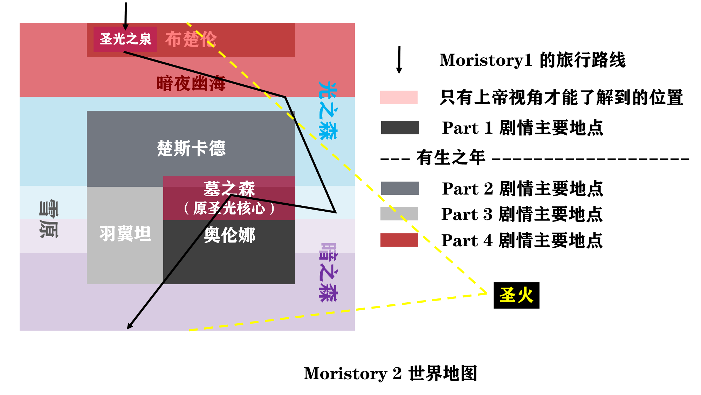

# Moristory2  
 
 
 
 ⚠该项目已经重新企划：https://github.com/MorizeroDev/Starvior
 ⚠本项目不再维护。
 
 
 
一款rpg，可能集成多种类型小游戏的游戏。

> Error 404 有生以来挖的最大坑，并下定决心填完它。

# 剧情  
划分为四个部分：  
* 奥伦娜篇（**计划2022.7.24发布正式版**）  
* 楚斯卡德篇  （有生之年系列）
* 羽翼坦篇  （有生之年系列）
* （布楚伦篇）再临暗之森篇  （有生之年系列）  
  

剧情创作：Error 404/困困困Y困死/WEY（按首字母排序） 

**和Moristory1有一定联系，但不影响直接从Moristory2开始剧情的体验。**

# 开发  
Unity版本：`2019.3`                   Android 最低支持：`4.4.1` 

工具：`Visual Studio Code `

需要`.Net Core 2.1`和`.Net Framework 4.7.1`，Android相关开发工具。

# 制作鸣谢 
制作：Moristory II Develop Project

UI/设计：Error 404/Victoria. 

人物形象：Victoria./Error 404/困困困Y困死/小婷 

剧情创作：Error 404/困困困Y困死/WEY（按首字母排序）  

美术：Victoria.

战斗系统：王者铜/南笙

玩法设计：南笙

线稿绘制/上色：Victoria./困困困Y困死/Error 404 

背景图：来自网络的免费渠道 

地图块：来自RPG Maker MV 

人物行走图：来自RPG Maker MV

测试/宝贵建议：冰棍/困困困Y困死/WEY（按首字母排序）  

音乐：来自网络的免费渠道（音效来自RPG Maker MV，部分来自Smile Game Builder）  

宣传（中二）：Error 404

# 计划发布平台
测试：Windows（优先），Android

正式：Windows，Android，IOS，Web（主要） UWP，Linux，Switch+3ds（如果可以）

# 世界地图

