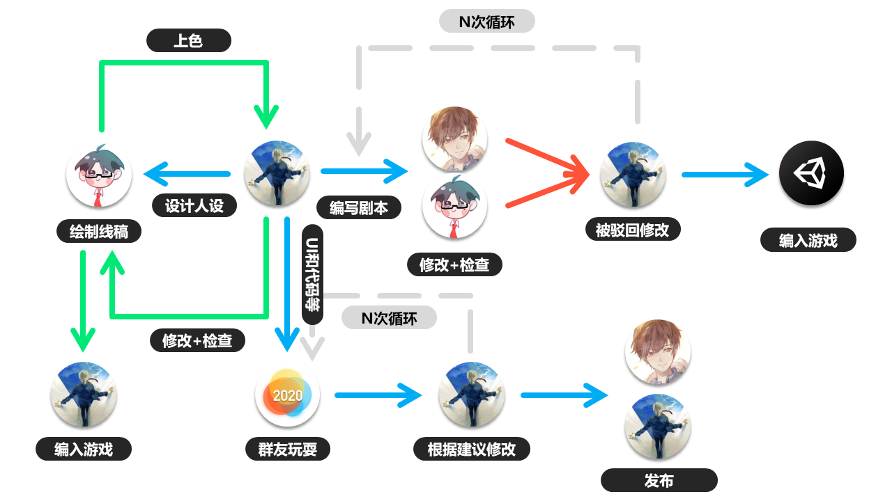

# Moristory2  
一款rpg，可能集成多种类型小游戏的游戏。
# 流程  
</img>
# 剧情  
划分为四个部分：  
* 奥伦娜篇（**计划2020.7.24发布正式版**）  
* 楚斯卡德篇  （有生之年系列）
* 羽翼坦篇  （有生之年系列）
* 再临暗之森篇  （有生之年系列）  
  
剧情创作：Error 404/困困困Y困死/WEY（按首字母排序）  
**和Moristory1有一定联系，但不影响直接从Moristory2开始剧情的体验**
# 开发  
Unity版本：2019.3  
Android 最低支持：4.4.1  
工具：Visual Studio Code  
需要.Net Core 2.1和.Net Framework 4.7.1，Android相关开发工具。
# 绘图  
UI：Error 404  
人物形象：Error 404/困困困Y困死/小婷  
线稿绘制：困困困Y困死  
上色：Error 404  
背景图：来自网络的免费渠道  
地图块：来自RPG Maker MV  
人物行走图：来自RPG Maker MV
# 音乐  
来自网络的免费渠道（音效来自RPG Maker MV）  
# 是否商业  
可能。
